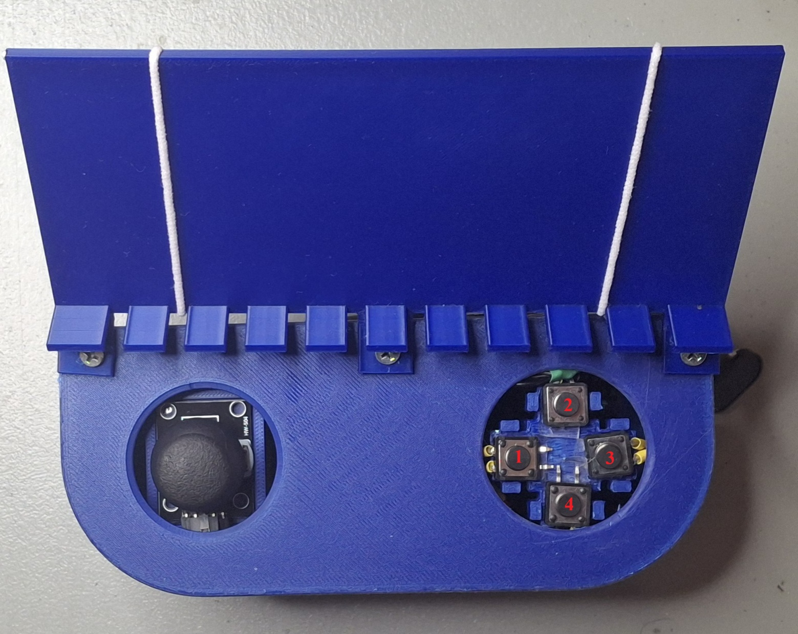

# Bluevale Collegiate Institute MechMania 2026 Team 2

- [Bluevale Collegiate Institute MechMania 2026 Team 2](#bluevale-collegiate-institute-mechmania-2026-team-2)
  - [Description](#description)
  - [Parts in Controller](#parts-in-controller)
  - [Parts in Car](#parts-in-car)
  - [Technical Notes](#technical-notes)
  - [Controller Instructions](#controller-instructions)
    - [Driving Mode](#driving-mode)
    - [Action Mode](#action-mode)
  - [Bill of Materials Link](#bill-of-materials-link)

## Description

This project was made possible by having two microcontrollers: one in the controller and one in the car. Communication between the controller and the car was made using a NRF24L01 in the controller (transmitter) and another NRF24L01 in the car (receiver).

In the Code folder, you will find all the code for the car and controller as well as wiring schematics. The schematics were made by a software called KiCad and the KiCad files are also located in this repository in case you would like to modify the schematics.

## Parts in Controller

- 1 Arduino Uno R3 Clone
- 1 NRF24L01 with breakout board (wireless transmitter)
- 1 AM-JOYSTICK
- 2 9V batteries (one for NRF24L01 and one for UNO)
- 4 push buttons

## Parts in Car

- 1 ELEGOO MEGA 2560 R3 Board (powered by 9V battery)
- 1 NRF24L01 with breakout board (wireless receiver)
- 2 motor drivers (MDD3A)
- 2 12V DC motors (400 RPM, higher torque, for wheels)
- 1 12V DC motor (400 RPM, higher torque, for drill)
- 1 12V DC motor (400 RPM, higher torque, for forklift)
- 1 11.1V 2200mAh Lipo Battery (power for the DC motors)
- 1 servo (MG996R, for platform tilt)
- 1 servo (MG996R, for platform drill tilt)
- 1 ESP32-CAM
- 4 AA batteries (powers servos and camera)

## Technical Notes

It is also important to note that the camera was not used as when the servo motors were powered, the camera turned off. To prevent this, in the future you may want to add a capacitor to the camera's 5V and GND pin. Also, 100 µF capacitors were used to connect the NRF24L01 power pins together in case of brownouts.

## Controller Instructions

There are two modes for the forklift: driving mode and action mode. Switching between the modes is done by pressing button 2.

Here are the rest of the controls:

### Driving Mode

This is the default mode when everything is plugged in.

- **Joystick movement:** Move direction (must press gas to actually move)
- **Joystick press:** Spin clockwise (away from drill)
- **Button 1:** Quarter speed
- **Button 2:** Change mode
- **Button 3:** Full speed
- **Button 4:** Half speed

### Action Mode

- **Joystick up/down:** Forklift up/down
- **Joystick press:** Nothing
- **Button 1:** Drill up/down (tree planting)
- **Button 2:** Change mode
- **Button 3:** Tilt platform 55 degrees/to neutral (mainly for sharp shooter)
- **Button 4:** Spin drill (tree planting)

## Bill of Materials Link

Here is the link to the bill of materials: [Link](https://docs.google.com/spreadsheets/d/1pDJakI2937subbM1QwxTJR9V5k_md9ht5O3d4-HkXg0/edit?usp=sharing)
