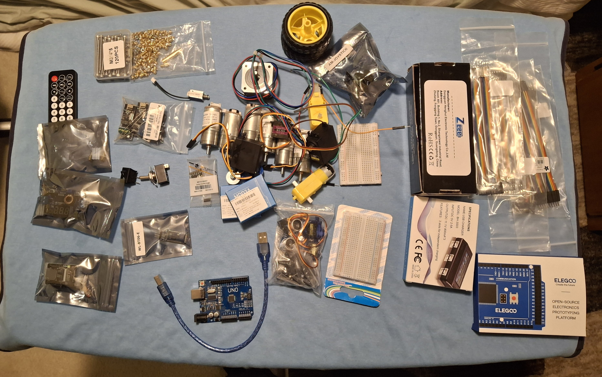

# Parts List

This file contains all electrical parts as well as mechanical parts.

- [Parts List](#parts-list)
  - [Electrical Parts](#electrical-parts)
    - [Microcontrollers](#microcontrollers)
    - [Motors/Drivers](#motorsdrivers)
    - [Sensors/Inputs/Switches](#sensorsinputsswitches)
    - [Power](#power)
    - [Remote Control](#remote-control)
    - [Miscellaneous](#miscellaneous)

## Electrical Parts

### Microcontrollers

| Quantity | Part Name                                | Description                                                                      | Information Link                                                                                                                |
| :------: | :--------------------------------------- | :------------------------------------------------------------------------------- | :------------------------------------------------------------------------------------------------------------------------------ |
| 1        | Arduino Uno R3 Clone with USB Cable      | A popular beginner-friendly 8-bit microcontroller board based on the ATmega328P. | [Visit documentation on the board](https://docs.arduino.cc/hardware/uno-rev3/)                                                  |
| 1        | ELEGOO MEGA 2560 R3 Board with USB Cable | A microcontroller based on the ATmega 2560.                                      | [Instructions for use](https://m.media-amazon.com/images/I/91RAy+evkrL.pdf)                                                     |
| 1        | ESP-32 CAM                               | A camera that can interact with Wifi and Bluetooth with a 2MP resolution.        | [Video streaming and face recognition](https://randomnerdtutorials.com/esp32-cam-video-streaming-face-recognition-arduino-ide/) |

### Motors/Drivers

| Quantity | Part Name                             | Part Number        | Description                                                                                    | Information Link                                                                                                                                                                    |
| :------: | :------------------------------------ | :----------------- | :--------------------------------------------------------------------------------------------- | :---------------------------------------------------------------------------------------------------------------------------------------------------------------------------------- |
| 6        | 12V DC Motor with Encoder             | 25SG-370CA-21.3-EN | 400 RPM motor.                                                                                 | [Motor datasheet](https://cdn.robotshop.com/rbm/a00a7635-653b-4220-aac9-b0c23c5c5e2c/9/937bc8fd-df7e-4549-84e7-739dc23aaa9d/c1a0ee55_25d-encoder-gear-motor-kits.pdf)               |
| 2        | Yellow TT Motor                       | N/A                | DC gearbox motor.                                                                              | [Product information](https://www.adafruit.com/product/3777)                                                                                                                        |
| 2        | Metal Gear Torque Digital Servo       | MG996R             | 55 g (weight) double ball bearing servo motor.                                                 | [Product information](https://www.diymore.cc/products/diymore-mg996r-metal-gear-high-speed-torque-servo-motor-digital-servo-55g-for-rc-helicopter-airplane-car-boat-robot-controls) |
| 2        | Miuzei Micro Servo Motor (Blue)       | MS18               | A 9 g (weight) micro servo motor.                                                              | [Amazon listing](https://www.amazon.ca/Miuzei-Helicopter-Airplane-Remote-Control/dp/B07H85M78M)                                                                                     |
| 1        | Tower Pro Micro Servo (Black)         | MG90S              | A 13.4 g (weight) micro servo motor.                                                           | [Servo information](https://towerpro.com.tw/product/mg90s-3/)                                                                                                                       |
| 1        | Nema 17 Bipolar Stepper Motor         | 17HS13-0404S1      | A stepper motor with a step angle of 1.8°, a shaft diameter of Φ5 mm and size 42 x 42 x 34 mm. | [Datasheet](https://www.omc-stepperonline.com/download/17HS13-0404S1.pdf)                                                                                                           |
| 2        | Maker Dual Channel 3A DC Motor Driver | MDD3A              | A motor driver that is able to run 3A per channel.                                             | [Datasheet](https://mm.digikey.com/Volume0/opasdata/d220001/medias/docus/204/105090004_Web.pdf)                                                                                     |
| 1        | DFRobot 2x1.2 A DC Motor Driver       | TB6612FNG          | A motor driver that supports 1.2A per channel.                                                 | [Product description](https://wiki.dfrobot.com/dri0044/)                                                                                                                            |
| 1        | Stepper Motor Driver Module           | A4988              | Microstepping motor driver with built-in translation.                                          | [Datasheet](https://www.allegromicro.com/~/media/files/datasheets/a4988-datasheet.pdf)                                                                                              |

### Sensors/Inputs/Switches

| Quantity | Part Name                 | Part Number | Description               | Information Link                                                                                                                                                   |
| :------: | :------------------------ | :---------- | :------------------------ | :----------------------------------------------------------------------------------------------------------------------------------------------------------------- |
| 1        | Ultrasonic Ranging Module | HC-SR04     | Used to measure distance. | [Datasheet](https://cdn.sparkfun.com/datasheets/Sensors/Proximity/HCSR04.pdf)                                                                                      |
| 9        | Large Button              |             |                           |                                                                                                                                                                    |
| 2        | Switches                  |             |                           |                                                                                                                                                                    |
| 1        | AM-JOYSTICK               |             |                           | [Product description](https://abra-electronics.com/robotics-embedded-electronics/arduino-shields/audio-video-game-shields/am-joystick-analog-joystick-module.html) |

### Power

| Quantity | Part Name                                                                               | Part Number | Description                                                             | Information Link                                                                                                                                                  |
| :------: | :-------------------------------------------------------------------------------------- | :---------- | :---------------------------------------------------------------------- | :---------------------------------------------------------------------------------------------------------------------------------------------------------------- |
| 2        | Zeee 11.1V 2200mAh Lipo Battery 3S Shorty Lipo 50C Soft Pack RC Battery with Deans Plug |             | An 11.1V lithium polymer battery pack.                                  | [Amazon listing](https://www.amazon.ca/Zeee-2200mAh-Battery-Airplane-Helicopter/dp/B0D9QKR1WJ)                                                                    |
| 1        | USB Charger                                                                             | BH-3S03     | Used to charge the Lipo batteries.                                      | [Product description](https://abra-electronics.com/batteries-holders/battery-chargers-testers/bat-charger-15-usb-3s-lipo-battery-pack-charger-11.1v-800ma.html)   |
| 2        | 12V Regulator                                                                           | LM2575T-12  | Used to reduce a higher input voltage to a lower stable output voltage. | [Datasheet](https://www.ti.com/lit/ds/symlink/lm2575-n.pdf)                                                                                                       |
| 1        | DC-DC High power LED Driver with Red Voltmeter Adjustable Step-down Charger Module      | HW-316E     | Converts larger DC voltages into smaller ones.                          | [RFID LIFE listing](https://shop.rfid-life.com/products/hw-316e-xl4015-5a-75w-dc-dc-high-power-led-driver-with-red-voltmeter-adjustable-step-down-charger-module) |

### Remote Control

| Quantity | Part Name                             | Part Number | Description                                                                                                                                                                           | Information Link                                                                                                                                                                                       |
| :------: | :------------------------------------ | :---------- | :------------------------------------------------------------------------------------------------------------------------------------------------------------------------------------ | :----------------------------------------------------------------------------------------------------------------------------------------------------------------------------------------------------- |
| 1        | IR Remote Controller                  |             |                                                                                                                                                                                       | [Product listing](https://www.tinyosshop.com/index.php?route=product/product&product_id=665)                                                                                                           |
| 2        | NRF24L01 (Transceiver and Receiver)   |             | Used to make wireless communcation between two Arduino boards.                                                                                                                        | [Tutorial](https://howtomechatronics.com/tutorials/arduino/arduino-wireless-communication-nrf24l01-tutorial/)                                                                                          |
| 1        | Bluetooth Module 1                    | WL-BT06-E   | This Wireless Bluetooth Transceiver Slave Module allows your device to both send or receive the TTL data via Bluetooth technology without connecting a serial cable to your computer. | [Product listing](https://abra-electronics.com/wireless/wireless-bluetooth-en/wl-bt06-e-rf-wireless-bluetooth-transceiver-slave-module-rs232-ttl-to-uart-converter-and-adapter-for-arduino-hc-06.html) |
| 1        | Bluetooth Module 2                    | HC-06       | A slave-only module.                                                                                                                                                                  | [Tutorial with Arduino](https://www.martyncurrey.com/arduino-and-hc-06-zs-040/)                                                                                                                        |

### Miscellaneous

| Quantity | Part Name                   | Part Number       | Description | Information Link                                                                                                                                                                                    |
| :------: | :-------------------------- | :---------------- | :---------- | :-------------------------------------------------------------------------------------------------------------------------------------------------------------------------------------------------- |
| 2        | NPN Transistor              | P2N222A and BC547 |             | [Datasheet P2N222A](https://www.onsemi.com/pdf/datasheet/p2n2222a-d.pdf), [BC547 information](https://www.seeedstudio.com/blog/2020/09/10/bc547-transistor-basic-knowledge-pinout-and-application/) |
| 2        | PNP Transistor              | BC557B            |             | [Datasheet](https://www.farnell.com/datasheets/296678.pdf)                                                                                                                                          |
| 1        | 50V 100uF Capacitor         |                   |             |                                                                                                                                                                                                     |
| 1        | 10V 1500uF Capacitor        |                   |             |                                                                                                                                                                                                     |
| 1        | 25V 680uF Capacitor         |                   |             |                                                                                                                                                                                                     |
| 4        | Diodes                      |                   |             |                                                                                                                                                                                                     |
| 1        | Electromagnet               |                   |             | [Product listing](https://www.adafruit.com/product/3872?srsltid=AfmBOopdHWw1D8Pn7Wg_neplB1FX3qU4yjKQzFZ2b9Pweh9NQRtVLy13)                                                                           |
| 1        | ROB-11015 (5V Solenoid)     | ZH0-0420S-05A4.5  |             | [Datasheet](https://cdn.sparkfun.com/datasheets/Robotics/ZHO-0420S-05A4.5%20SPECIFICATION.pdf)                                                                                                      |
| 2        | Small Breadboard            |                   |             |                                                                                                                                                                                                     |
| A lot    | Male to Female Jumper Wires |                   |             |                                                                                                                                                                                                     |
| A lot    | Male to Male Jumper Wires   |                   |             |                                                                                                                                                                                                     |
